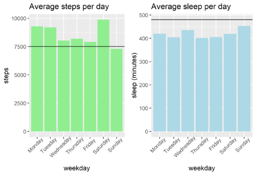
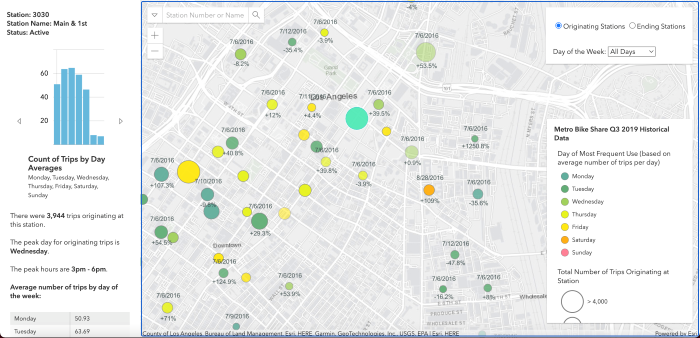

phone: (310) 594-2227  
email: marcio.arakaki22@gmail.com  
LinkedIn: https://www.linkedin.com/in/marcioarakaki/

## [Bellabeat Case Study](https://github.com/MarcioArak/BellaBeat-Case-Study)
* Identified trends in smart-device user data to apply to Bellabeat's marketing strategy
* Used R and Google Sheets to clean and visualize the datasets from Kaggle
* Calculated average steps users and walk and average sleep that users get on a daily basis
* Calculated the amount of active to sedentary users
* Suggested actions based on the discoveries made

## [Metro Bike Share App](https://github.com/MarcioArak/Metro-Bike-Share-Data)
* Created an application that displays a map of LA metro bike stations as markers
* Uses data gathered from [Metro Bike Share website](https://bikeshare.metro.net/about/data/)
* The application shows which days are the busiest as well as which hours are the busiest
* The stations can be filtered by day of the week to show only information about the selected day

## [Planet 404 3D Game](https://github.com/MarcioArak/3D-Game-Planet-404)
Created a 3D game using Unity engine. My tasks was to write all the game mechanics such as:
* UI and Game menu
* Combat system, turned-based and 3rd person shooter
* Player and enemy scripts
* Interactable objects

