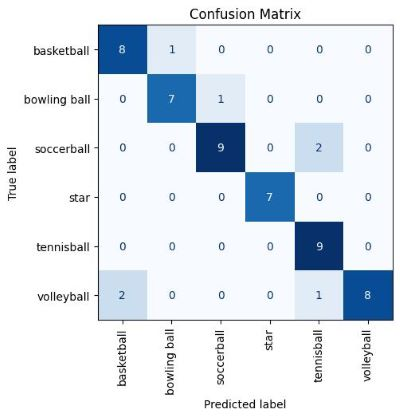

**email: marcio.arakaki22@gmail.com**  
**LinkedIn: https://www.linkedin.com/in/marcioarakaki/**

## React Social Media Webstie
[[Link to project]](https://github.com/MarcioArak/me-so-social)
* Developed a comprehensive, full-stack social media platform utilizing React, featuring a responsive design optimized for seamless user experience across various devices, including desktops, mobile phones, and tablets.
* The website is integrated with an SQL database for robust data management and storage
* Back-end uses CORS for front-end and back-end communication and cookies to pass information
* Designed for posting messages and uploading images, while also providing functionality to customize user profiles, including options to set profile and cover pictures
* Pages include: Home, profile, login and register page

## Metro Bike Share App
[[Link to project]](https://github.com/MarcioArak/Metro-Bike-Share-Data)
* Developed an application showcasing a map interface featuring markers representing LA metro bike stations, providing users with visual navigation and location information.
* Uses data gathered from [Metro Bike Share website](https://bikeshare.metro.net/about/data/)
* The application displays information on each bike station as a pop-up such as active or inactive and number of trips per hour or per day.
* The pop-up also shows which days are the busiest as well as which hours are the busiest
* The stations can be filtered by day of the week to show only information about the selected day

## Image Classification
[[Link to project]](https://github.com/MarcioArak/Image-Classification)
* Built an image classification model and trained it to identify different kinds of sports balls
* The application takes images of sport balls that are classified by folder and trains the model to recognize and label images based on the trained data.
* Model has about a 80-90% accuracy in classifying images of up to 5 categories
* Used data augmentation to acquire more training images (rotating, flipping and zooming in and out of images)
* Configure data for better processing and training
* Used K-Fold cross validation to evaluate the model

## Bellabeat Case Study
[[Link to project]](https://github.com/MarcioArak/BellaBeat-Case-Study)
* Identified trends in smart-device user data to apply to Bellabeat's marketing strategy
* Datasets are made publicly available by Morbius and collects data from 30 Fitbit users.
* Analyzed data from participants such as number steps taken during each day, number of calories burned, and amount of sleep user’s get.
* Used R and Google Sheets to clean and visualize the datasets from Kaggle
* Calculated average steps users take and average sleep that users get on a daily basis
* Calculated the amount of active to sedentary users
* Suggested actions based on the discoveries made

## Planet 404 3D Game
[[Link to project]](https://github.com/MarcioArak/3D-Game-Planet-404)  

Created a 3D game using Unity engine. Game is a third-person adventure with elements such as third-person shooting and turned-based combat.  
The player must collect items found on the planet in order to survive and fight off aliens. It is open world survival where you can explore various places.  

My tasks was to write all the game mechanics such as:
* UI and Game menu
* Combat system: turned-based and 3rd person shooter
* Player and enemy scripts
* Interactable objects

